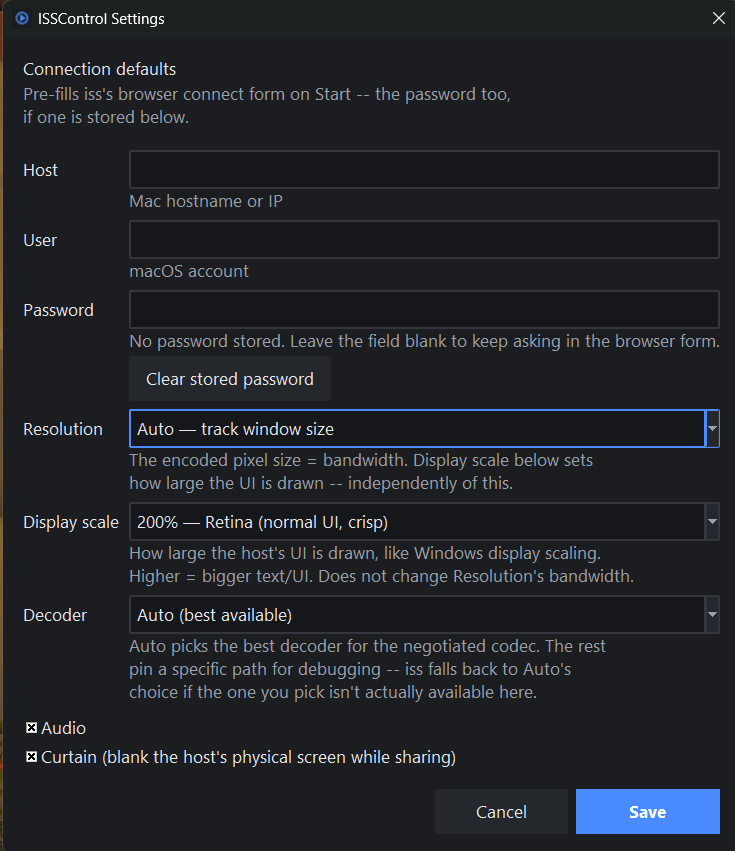

# ISSControl

A start/stop control panel for [iShareScreen](https://github.com/renegadelink/iShareScreen),
with status on whether your local install is behind upstream.

`iss` has no PATH-friendly launcher and no documented way to stop a running
session short of killing it. ISSControl manages it as a subprocess instead of
requiring a terminal: Start, Stop, and a status line for whether your install
is behind the upstream repo.


## The PATH problem this works around

`pip install`ing iShareScreen drops its `iss` console script into whichever
Python's `Scripts` directory was active at install time -- a venv, or (very
often on Windows) the per-user install under `%APPDATA%\Python\PythonXY`.
Neither is reliably on PATH, so a plain `iss` typed at a shell often does
nothing. ISSControl resolves the launcher itself: the interpreter it's
running under, PATH, then the well-known per-user install locations pip
uses -- so Start works whether or not `iss` itself is reachable from a
terminal. If none of that finds it, set the `ISSCONTROL_ISS_PATH`
environment variable to the full path, or add it as `iss_path_override` in
`settings.json` (see below).

## Using it

- **Start** launches `iss` as a managed subprocess and streams its output
  into the log pane below. **Stop** takes down the whole process tree --
  `iss` has no shutdown path of its own to ask for nicely, so this is the
  only way to end a session short of closing its browser tab and hoping. If
  `iss` crashes or is closed some other way, the status card notices on its
  own and resets the buttons rather than sitting on "Running" forever.
- The **iShareScreen install** card checks, in the background on startup,
  whether your installed commit matches upstream's current HEAD (`git
  ls-remote`, since that resolves the default branch for you without
  needing an API key). If you're behind, **Update** runs `pip install
  --upgrade --force-reinstall` against the same Python environment `iss` is
  actually installed in -- not necessarily the one running ISSControl --
  and streams that into the log pane too.
- **Settings...** opens connection defaults for Start: host, user,
  resolution, display scale, decoder, audio, and curtain, which pre-fill
  iss's browser connect form the same way passing them as CLI flags would.
  Resolution, display scale, and decoder are dropdowns with the same
  options and defaults as that form itself (pulled from iShareScreen's own
  `isharescreen.gui.connect` source, not reinvented) -- Resolution is the
  encoded backing size (bandwidth), Display scale is how large the host
  draws its UI on top of that, and the two combine into iss's `--advertise`
  flag exactly the way the web form's own launch code does. The password
  field stores into Windows Credential Manager via `keyring`, not
  settings.json -- iss has no `--password` flag on purpose, since anything
  on argv is visible in `ps` / Task Manager, so a stored password only ever
  reaches it piped to `--password-stdin`.

  
- Window position/size and the connection defaults above persist between
  sessions in a per-user `settings.json` (`%LOCALAPPDATA%\ISSControl` on
  Windows). `iss_path_override` and `iss_args` in that file don't have a
  dialog of their own yet, but are read and applied if you want to
  hand-edit them in.

## Running it

The [Releases page](https://github.com/Tharavol/ISSControl/releases) has a
zip of the source for each tagged version. Unzip it and install like any
other Python project -- there's no standalone exe, since anyone running
this already needs a Python environment with `iss` itself `pip install`ed
into it (see above), so a compiled build wouldn't remove the one real
dependency:

```sh
pip install -e .
isscontrol
# or: python -m isscontrol
```

Cloning the repo works the same way instead of downloading the zip.

On Windows, double-clicking `isscontrol.pyw` runs the same app without a
console window flashing up behind it. It has no shebang, so Windows opens
it with whichever Python the `py` launcher defaults to -- if that isn't
the interpreter you ran `pip install -e .` under (common with more than
one Python installed), the double-click will fail with a message box
naming the interpreter it tried to use. Fix it by installing ISSControl's
dependencies into that same interpreter, e.g.:

```sh
py -3.13 -m pip install -e .   # or whichever version `py -0p` marks as default
```

`keyring` is the dependency most likely to bite here specifically: it's
what the password field (above) reads and writes to Credential Manager
through, and it's the same `pip install -e .` that pulls it in. If
`keyring` isn't installed into the interpreter ISSControl actually runs
under -- the same multi-Python mismatch as above, just without the
message box, since it only breaks the password field rather than startup
-- saving or loading a password will fail silently. On Windows, `keyring`
declares its Credential Manager backend (`pywin32-ctypes`) as a normal
dependency, so a plain `pip install keyring` (or `pip install -e .` for
this project) is enough; there's no separate backend package to install
by hand.

## Releasing

Pushing a `vX.Y.Z` tag runs [.github/workflows/release.yml](.github/workflows/release.yml):
tests, then a zip of the source files (`isscontrol/`, `isscontrol.pyw`,
`pyproject.toml`, `README.md`, `LICENSE`, `CHANGELOG.md`, `AUTHORS`)
attached to a GitHub Release for that tag. No compiled build -- see
[CHANGELOG.md](CHANGELOG.md) for why v1.3.0's standalone `ISSControl.exe`
was reverted.

## Status

- **Working**: Start/Stop/Update as a managed subprocess, install-vs-upstream
  status, a settings dialog for connection defaults with a Credential
  Manager-backed password, a console-free launcher, and a source zip built
  and released automatically on each tag. See [CHANGELOG.md](CHANGELOG.md)
  for what shipped in each version.
- All milestones through v1.3.0 are done; nothing further is currently planned.

See the [issue tracker](https://github.com/Tharavol/ISSControl/issues) and
[milestones](https://github.com/Tharavol/ISSControl/milestones) for details.

## License

GPL-3.0-or-later. See [LICENSE](LICENSE).

iShareScreen itself is AGPL-3.0-or-later; ISSControl only launches it as a
subprocess and does not link against its code.
