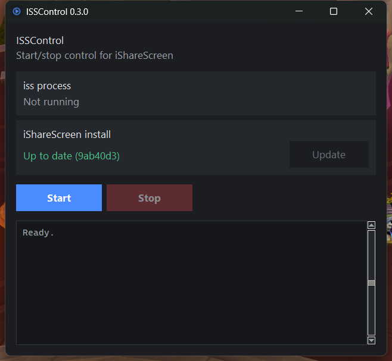

# ISSControl

A start/stop control panel for [iShareScreen](https://github.com/renegadelink/iShareScreen),
with status on whether your local install is behind upstream.

`iss` has no PATH-friendly launcher and no documented way to stop a running
session short of killing it. ISSControl manages it as a subprocess instead of
requiring a terminal: Start, Stop, and a status line for whether your install
is behind the upstream repo.



## The PATH problem this works around

`pip install`ing iShareScreen drops its `iss` console script into whichever
Python's `Scripts` directory was active at install time -- a venv, or (very
often on Windows) the per-user install under `%APPDATA%\Python\PythonXY`.
Neither is reliably on PATH, so a plain `iss` typed at a shell often does
nothing. ISSControl resolves the launcher itself: the interpreter it's
running under, PATH, then the well-known per-user install locations pip
uses -- so Start works whether or not `iss` itself is reachable from a
terminal. If none of that finds it, set the `ISSCONTROL_ISS_PATH`
environment variable to the full path, or add it as `iss_path_override` in
`settings.json` (see below).

## Using it

- **Start** launches `iss` as a managed subprocess and streams its output
  into the log pane below. **Stop** takes down the whole process tree --
  `iss` has no shutdown path of its own to ask for nicely, so this is the
  only way to end a session short of closing its browser tab and hoping. If
  `iss` crashes or is closed some other way, the status card notices on its
  own and resets the buttons rather than sitting on "Running" forever.
- The **iShareScreen install** card checks, in the background on startup,
  whether your installed commit matches upstream's current HEAD (`git
  ls-remote`, since that resolves the default branch for you without
  needing an API key). If you're behind, **Update** runs `pip install
  --upgrade --force-reinstall` against the same Python environment `iss` is
  actually installed in -- not necessarily the one running ISSControl --
  and streams that into the log pane too.
- **Settings...** opens connection defaults for Start: host, user,
  resolution, display scale, decoder, audio, and curtain, which pre-fill
  iss's browser connect form the same way passing them as CLI flags would
  (`iss --host mac.local -u me --advertise 1920x1080 --no-curtain`). The
  password field stores into Windows Credential Manager via `keyring`, not
  settings.json -- iss has no `--password` flag on purpose, since anything
  on argv is visible in `ps` / Task Manager, so a stored password only ever
  reaches it piped to `--password-stdin`.
- Window position/size and the connection defaults above persist between
  sessions in a per-user `settings.json` (`%LOCALAPPDATA%\ISSControl` on
  Windows). `iss_path_override` and `iss_args` in that file don't have a
  dialog of their own yet, but are read and applied if you want to
  hand-edit them in.

## Running it

```sh
pip install -e .
isscontrol
# or: python -m isscontrol
```

On Windows, double-clicking `isscontrol.pyw` runs the same app without a
console window flashing up behind it. It has no shebang, so Windows opens
it with whichever Python the `py` launcher defaults to -- if that isn't
the interpreter you ran `pip install -e .` under (common with more than
one Python installed), the double-click will fail with a message box
naming the interpreter it tried to use. Fix it by installing ISSControl's
dependencies into that same interpreter, e.g.:

```sh
py -3.13 -m pip install -e .   # or whichever version `py -0p` marks as default
```

## Status

- **Working**: Start/Stop/Update as a managed subprocess, install-vs-upstream
  status, a settings dialog for connection defaults with a Credential
  Manager-backed password, and a console-free launcher. See
  [CHANGELOG.md](CHANGELOG.md) for what shipped in each version.
- All milestones through v1.1.0 are done; nothing further is currently planned.

See the [issue tracker](https://github.com/Tharavol/ISSControl/issues) and
[milestones](https://github.com/Tharavol/ISSControl/milestones) for details.

## License

GPL-3.0-or-later. See [LICENSE](LICENSE).

iShareScreen itself is AGPL-3.0-or-later; ISSControl only launches it as a
subprocess and does not link against its code.
